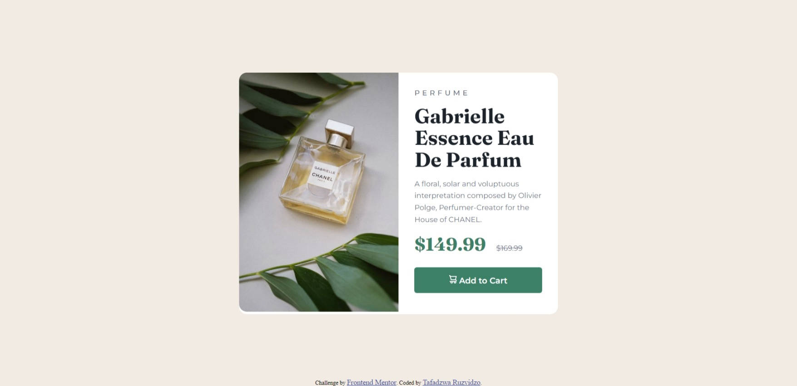

# Frontend Mentor - Product preview card component solution

This is a solution to the [Product preview card component challenge on Frontend Mentor](https://www.frontendmentor.io/challenges/product-preview-card-component-GO7UmttRfa). Frontend Mentor challenges help you improve your coding skills by building realistic projects. 

## Table of contents

- [Overview](#overview)
  - [The challenge](#the-challenge)
  - [Screenshot](#screenshot)
  - [Links](#links)
- [My process](#my-process)
  - [Built with](#built-with)
  - [What I learned](#what-i-learned)
  - [Continued development](#continued-development)
  - [Useful resources](#useful-resources)
- [Author](#author)

## Overview

### The challenge

Users should be able to:

- View the optimal layout depending on their device's screen size
- See hover and focus states for interactive elements

### Screenshot

### Links

- Solution URL: [Add solution URL here](https://your-solution-url.com)
- Live Site URL: [Add live site URL here](https://your-live-site-url.com)

## My process

### Built with

- Semantic HTML5 markup
- CSS custom properties
- Flexbox
- CSS Grid
- Mobile-first workflow

### What I learned

I learn to us CSS flex box and grid.
I also now know how to put responsive pictures.

### Continued development

In this project I see how much Im lacking in terms of reponsive design. I intend to learn more about that latter.

### Useful resources

- [web.dev](https://www.web.dev) - This helped me have a deep knowledge about CSS. I really liked this this site and will use it going forward. 

## Author

- Website - [Add your name here](https://www.your-site.com)
- Frontend Mentor - [@Taffy-R](https://www.frontendmentor.io/profile/Taffy-R)
- Twitter - [@tafadzwaruzvidz](https://www.twitter.com/tafadzwaruzvidz)
